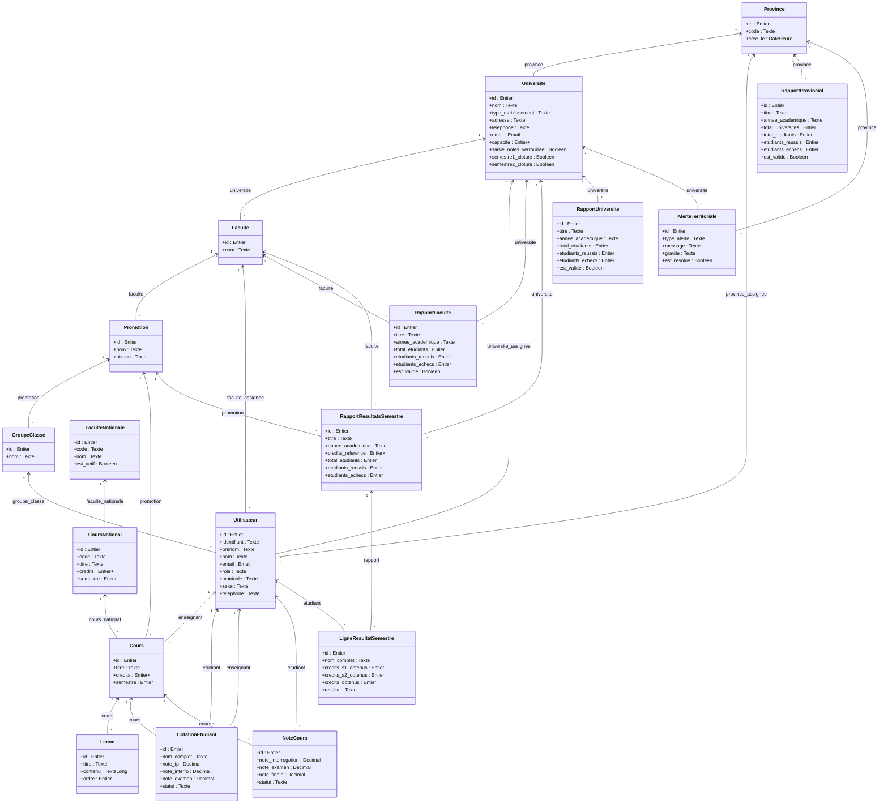

# Diagramme de classes (vue d'ensemble)

Fichier complet (40 tables) : [`diagramme_classes.md`](./diagramme_classes.md) · [`diagramme_classes.mmd`](./diagramme_classes.mmd)

## Rôles de Utilisateur

| Valeur | Libellé |
|---|---|
| `SUPER_ADMIN` | Super Administrateur (Ministère) |
| `PROVINCIAL_ADMIN` | Administrateur Provincial |
| `MANAGER` | Gestionnaire (Université) |
| `DEAN` | Décanat (Faculté) |
| `TEACHER` | Enseignant |
| `STUDENT` | Étudiant |

## Remontée des résultats

